# Diverga v8.1.0 - Software Design Document (SDD)

**Document Version**: 1.2
**System Version**: 8.1.0
**Date**: 2026-02-09
**Author**: Diverga Project Team
**Status**: Released

---

## Table of Contents

1. [Introduction](#1-introduction)
2. [System Architecture](#2-system-architecture)
3. [Component Design](#3-component-design)
4. [Data Design](#4-data-design)
5. [Interface Design](#5-interface-design)
6. [File Structure](#6-file-structure)
7. [Model Routing Matrix](#7-model-routing-matrix)
8. [Version History](#8-version-history)

---

## 1. Introduction

### 1.1 Purpose

This Software Design Document describes the architecture, components, data structures, and interfaces of **Diverga v8.1.0**, a research methodology AI assistant built as a Claude Code plugin. Diverga orchestrates 44 specialized agents across the complete academic research lifecycle -- from question formulation to publication -- while preventing AI mode collapse through Verbalized Sampling (VS) and HAVS methodologies.

### 1.2 Scope

Diverga operates within the Claude Code plugin ecosystem and provides:

- **44 specialized research agents** organized in 9 categories (A through I)
- **Verbalized Sampling (VS) methodology** to prevent mode collapse in AI recommendations
- **HAVS (Humanization-Adapted VS)** for natural academic text transformation
- **Human Checkpoint System** enforcing researcher oversight at critical decision points
- **Memory System** for cross-session context persistence and decision audit trails
- **HUD Statusline** for real-time research progress visibility
- **Bilingual support** for English and Korean (EN + KR)

Target domains: Education, Psychology, Management, Sociology, HRD, Communication, and other social science disciplines.

### 1.3 Definitions, Acronyms, and Abbreviations

| Term | Definition |
|------|-----------|
| **VS** | Verbalized Sampling -- methodology from arXiv:2510.01171 that prevents AI mode collapse by exploring the long tail of intellectual possibility |
| **HAVS** | Humanization-Adapted VS -- a 3-phase specialization of VS for text transformation |
| **T-Score** | Typicality Score (0.0-1.0) -- measures how conventional a recommendation is; lower values indicate more novel/divergent options |
| **Mode Collapse** | The tendency of AI systems to converge on the same predictable, "safe" recommendations |
| **Checkpoint** | A mandatory pause point where the system stops and waits for explicit human approval |
| **HUD** | Heads-Up Display -- a terminal statusline showing research project state |
| **PRISMA** | Preferred Reporting Items for Systematic Reviews and Meta-Analyses (2020 standard) |
| **RQ** | Research Question |
| **IRB** | Institutional Review Board |
| **RAG** | Retrieval-Augmented Generation |
| **OSF** | Open Science Framework |
| **RoB** | Risk of Bias |
| **SEM** | Structural Equation Modeling |
| **CP** | Checkpoint (prefix in checkpoint identifiers) |
| **Dual-Tree** | Filesystem pattern separating stable baselines from active changes |

### 1.4 Reference Documents

| Document | Location | Description |
|----------|----------|-------------|
| CLAUDE.md | `/CLAUDE.md` | Primary architecture reference and agent dispatch rules |
| README.md | `/README.md` | User-facing overview and installation guide |
| DESIGN_SYSTEM.md | `/docs/DESIGN_SYSTEM.md` | Void Cartography visual design system |
| HAVS Integration | `/docs/havs-integration.md` | HAVS methodology specification |
| v7.0 Release Notes | `/docs/releases/v7.0-RELEASE-NOTES.md` | Memory System specification |
| v8.0 Release Notes | `/docs/releases/v8.0-RELEASE-NOTES.md` | HUD and Project Visibility specification |
| CHANGELOG | `/docs/CHANGELOG.md` | Complete version history |
| Agent Orchestration Guide | `/docs/AGENT-ORCHESTRATION-GUIDE.md` | Detailed agent dispatch documentation |
| VS Methodology (arXiv) | arXiv:2510.01171 | Original Verbalized Sampling paper |

---

## 2. System Architecture

### 2.1 High-Level Architecture

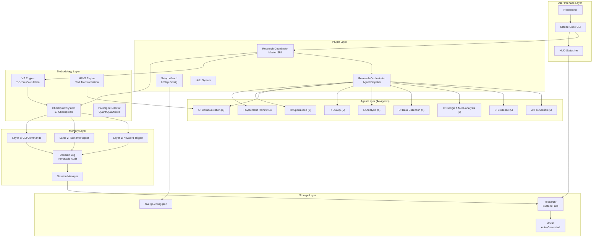

### 2.2 Component Overview

Diverga is structured as a five-layer system:

| Layer | Components | Responsibility |
|-------|-----------|----------------|
| **User Interface** | HUD, Claude Code CLI | Researcher interaction, progress visibility |
| **Plugin** | Coordinator, Orchestrator, Setup, Help | Skill dispatch, agent management, configuration |
| **Methodology** | VS Engine, HAVS Engine, Checkpoint System, Paradigm Detector | Research methodology enforcement, mode collapse prevention |
| **Agent** | 44 specialized agents (A1-I3) | Domain-specific research task execution |
| **Memory & Storage** | 3-Layer Context, Decision Log, Session Manager, Filesystem | Context persistence, audit trail, project state |

### 2.3 Deployment Model

Diverga deploys as a **Claude Code plugin** with the following installation topology:

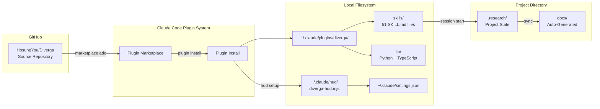

**Installation methods**:
1. Plugin Marketplace: `/plugin marketplace add` followed by `/plugin install diverga`
2. Local symlinks: Clone repository, create symlinks to `~/.claude/skills/`
3. Codex CLI: `npx @diverga/codex-setup` for OpenAI Codex integration

---

## 3. Component Design

### 3.1 Agent System (44 Agents, 9 Categories A-I)

#### 3.1.1 Agent Categories

| Category | Name | Count | Agents | Paradigm Scope |
|----------|------|-------|--------|----------------|
| **A** | Foundation | 6 | A1-A6 | All |
| **B** | Evidence | 5 | B1-B5 | All |
| **C** | Design & Meta-Analysis | 7 | C1-C7 | Paradigm-specific + Meta |
| **D** | Data Collection | 4 | D1-D4 | Method-specific |
| **E** | Analysis | 5 | E1-E5 | Paradigm-specific |
| **F** | Quality | 5 | F1-F5 | All |
| **G** | Communication | 6 | G1-G6 | All |
| **H** | Specialized | 2 | H1-H2 | Qualitative |
| **I** | Systematic Review | 4 | I0-I3 | All |

#### 3.1.2 Agent Lifecycle

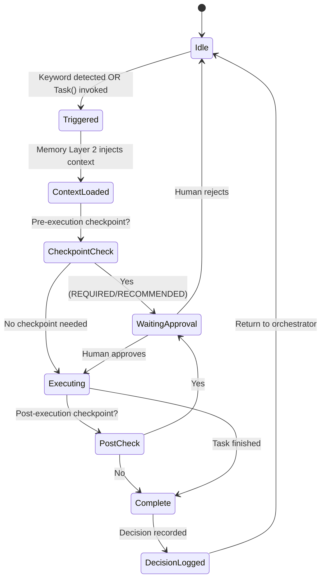

#### 3.1.3 Model Routing

Agents are assigned to one of three model tiers based on task complexity:

| Tier | Model | Purpose | Agent Count |
|------|-------|---------|-------------|
| **HIGH** | Opus | Complex reasoning, orchestration, creative tasks | 17 |
| **MEDIUM** | Sonnet | Standard processing, data extraction, search | 16 |
| **LOW** | Haiku | Efficient operations, validation, code generation | 8 |

**Routing decision criteria**:
- Opus: Multi-step reasoning, theoretical synthesis, design decisions, pipeline orchestration
- Sonnet: Single-domain tasks, data processing, evaluation, search operations
- Haiku: Extraction, validation, code generation, checklist management

#### 3.1.4 Parallel Execution Groups

Independent agents can execute concurrently via the Claude Code Task tool:

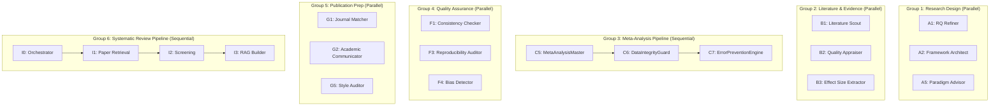

#### 3.1.5 Sequential Pipeline Rules

Certain agent combinations must execute in strict order due to data dependencies:

| Pipeline | Sequence | Reason |
|----------|----------|--------|
| Meta-Analysis | C5 -> C6 -> C7 | C5 orchestrates; C6 extracts data; C7 validates |
| Humanization | G5 -> G6 -> F5 | G5 audits patterns; G6 transforms; F5 verifies |
| Systematic Review | I0 -> I1 -> I2 -> I3 | I0 coordinates; I1 retrieves; I2 screens; I3 builds RAG |

#### 3.1.6 Auto-Trigger Dispatch Mechanism

Diverga detects keywords in user messages and automatically activates the appropriate agent:

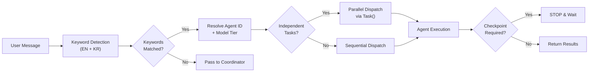

**Example dispatch**: The user message "I want to conduct a meta-analysis on AI-assisted learning. Need to extract effect sizes from 50 PDFs." triggers:
- `diverga:c5` (MetaAnalysisMaster, Opus) -- keyword "meta-analysis"
- `diverga:b3` (EffectSizeExtractor, Haiku) -- keyword "extract effect sizes"
- `diverga:b5` (ParallelDocumentProcessor, Opus) -- keyword "50 PDFs"

Execution plan: `[PARALLEL] c5 + b5`, then `[SEQUENTIAL] c6 -> c7`.

### 3.2 Memory System (v7.0+)

#### 3.2.1 Three-Layer Context Architecture

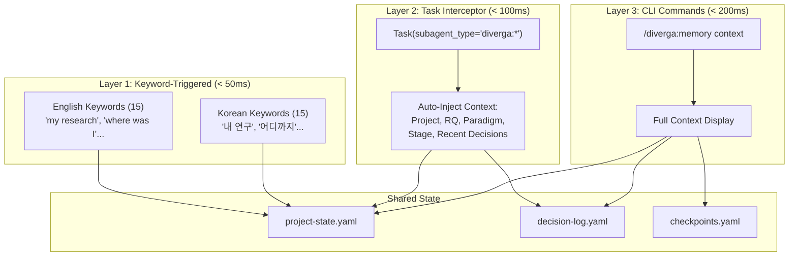

| Layer | Trigger Type | Latency | Use Case |
|-------|-------------|---------|----------|
| **Layer 1** | Natural language keywords | < 50ms | "Where was I?", "내 연구 진행" |
| **Layer 2** | Task tool agent invocation | < 100ms | Any `diverga:*` agent call auto-enriched |
| **Layer 3** | Explicit CLI command | < 200ms | `/diverga:memory context` for full details |

#### 3.2.2 Project Structure (.research/)

The Memory System uses a **Dual-Tree** filesystem design separating stable foundations from active work:

```
.research/
├── baselines/                 # STABLE TREE (verified foundations)
│   ├── literature/            # Literature foundations
│   │   ├── search-strategy.md
│   │   └── inclusion-criteria.md
│   ├── methodology/           # Methodology decisions
│   │   ├── research-design.md
│   │   └── sampling-plan.md
│   └── framework/             # Theoretical frameworks
│       └── conceptual-model.md
│
├── changes/                   # WORKING TREE
│   ├── current/               # Active work
│   │   ├── proposal.md
│   │   ├── data-extraction.xlsx
│   │   └── notes.md
│   └── archive/               # Completed stages (timestamped)
│       ├── 2026-02-01-foundation/
│       │   ├── snapshot.yaml
│       │   └── artifacts/
│       └── 2026-02-03-evidence/
│           ├── snapshot.yaml
│           └── artifacts/
│
├── sessions/                  # Session records
│   ├── session-abc123.yaml
│   └── session-def456.yaml
│
├── project-state.yaml         # Project metadata
├── decision-log.yaml          # All decisions (immutable)
├── checkpoints.yaml           # Checkpoint states
└── hud-state.json             # HUD display cache
```

#### 3.2.3 Decision Audit Trail

Decisions are stored as **immutable** YAML entries. Amendments create new entries referencing the original via an `amends` field rather than modifying existing records.

Decision entry structure:
- `id`: Unique identifier (e.g., "dec-003")
- `timestamp`: ISO 8601 creation time
- `checkpoint`: Associated checkpoint ID
- `stage`: Research stage at time of decision
- `agent`: Agent that facilitated the decision
- `decision.selected`: The option chosen by the human
- `decision.alternatives[]`: All options presented, each with `option`, `t_score`, and `rationale`
- `decision.vs_process`: VS methodology metadata (modal avoided, exploration depth)
- `rationale`: Human's stated reason for selection
- `context`: Research question, paradigm, and prior decision references
- `metadata`: Session ID, confirmation flag, confirmation timestamp

#### 3.2.4 Cross-Session Persistence

The Memory System provides continuity across Claude Code sessions through:

1. **Project state file** (`project-state.yaml`): Persists project name, research question, paradigm, current stage, and configuration
2. **Decision log** (`decision-log.yaml`): Immutable record of all human decisions with full context
3. **Session records** (`sessions/`): Each session captures decisions made, agents invoked, checkpoints passed, and stage transitions
4. **Stage archiving**: Completed stages are archived with timestamped snapshots for rollback capability

#### 3.2.5 Lifecycle Hooks

| Hook | Trigger | Auto-Captured Data |
|------|---------|-------------------|
| `session_start` | Conversation begins | Loads project context, recent decisions |
| `checkpoint_reached` | Human checkpoint passed | Decision with rationale, T-Score, alternatives |
| `agent_completed` | Agent finishes task | Agent output, execution time, success/failure |
| `session_end` | Conversation ends | Session summary, session record saved |

### 3.3 Human Checkpoint System

#### 3.3.1 Checkpoint Types

Diverga defines **17 checkpoints** across three severity levels:

| Level | Icon | Behavior | Count |
|-------|------|----------|-------|
| **REQUIRED** | Red circle | System STOPS. Cannot proceed without explicit approval. | 8 |
| **RECOMMENDED** | Orange circle | System PAUSES. Strongly suggests approval. | 5 |
| **OPTIONAL** | Yellow circle | System ASKS. Defaults available if skipped. | 4 |

#### 3.3.2 Complete Checkpoint Reference

| Checkpoint ID | Stage | Level | Trigger Condition |
|---------------|-------|-------|-------------------|
| `CP_RESEARCH_DIRECTION` | Foundation | REQUIRED | Research question finalized |
| `CP_PARADIGM_SELECTION` | Foundation | REQUIRED | Methodology approach chosen |
| `CP_THEORY_SELECTION` | Foundation | RECOMMENDED | Framework identified |
| `CP_ETHICS_REVIEW` | Foundation | OPTIONAL | IRB considerations |
| `CP_METHODOLOGY_APPROVAL` | Design | REQUIRED | Design complete |
| `CP_SAMPLING_STRATEGY` | Design | RECOMMENDED | Sample size determined |
| `CP_DATABASE_SELECTION` | Evidence | RECOMMENDED | Databases chosen |
| `CP_SCREENING_CRITERIA` | Evidence | REQUIRED | Inclusion/exclusion criteria |
| `CP_QUALITY_APPRAISAL` | Analysis | RECOMMENDED | Bias assessment complete |
| `CP_SYNTHESIS_APPROACH` | Analysis | REQUIRED | Analysis method selected |
| `CP_EFFECT_SIZE_VALIDATION` | Analysis | OPTIONAL | Effect sizes verified |
| `CP_HETEROGENEITY_CHECK` | Analysis | OPTIONAL | I-squared assessment |
| `CP_HUMANIZATION_REVIEW` | Reporting | RECOMMENDED | AI pattern check |
| `CP_FINAL_REVIEW` | Reporting | REQUIRED | Manuscript complete |
| `CP_PREREGISTRATION` | Reporting | OPTIONAL | OSF registration |
| `CP_PRISMA_DIAGRAM` | Reporting | REQUIRED | Flow diagram generated |
| `CP_JOURNAL_SELECTION` | Publication | REQUIRED | Target journal selected |

**Systematic Review additional checkpoints** (Category I):

| Checkpoint ID | Level | Description |
|---------------|-------|-------------|
| `SCH_DATABASE_SELECTION` | REQUIRED | Approve database selection before retrieval |
| `SCH_SCREENING_CRITERIA` | REQUIRED | Approve inclusion/exclusion criteria |
| `SCH_RAG_READINESS` | RECOMMENDED | Confirm PDF download and RAG readiness |
| `SCH_PRISMA_GENERATION` | OPTIONAL | Generate PRISMA 2020 flow diagram |

#### 3.3.3 Checkpoint Protocol Flow

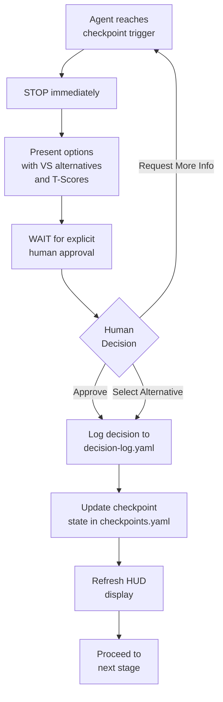

**Invariant rules**:
- NEVER proceed without explicit approval on REQUIRED checkpoints
- NEVER assume approval based on context
- ALWAYS present alternatives with T-Scores at decision checkpoints
- ALWAYS log the decision with rationale before continuing

#### 3.3.4 Integration with VS Methodology

At each checkpoint that involves a research choice, the VS Engine generates alternatives:

```
Stage 1: Context & Modal Identification
  Identify the "obvious" (modal) recommendation

Stage 2: Divergent Exploration
  Direction A (T ~ 0.6): Safe but differentiated
  Direction B (T ~ 0.4): Balanced novelty    [recommended]
  Direction C (T < 0.3): Innovative/experimental

Stage 3: Human Selection (CHECKPOINT)
  Present ALL options with T-Scores
  WAIT for human decision
  Execute ONLY selected direction
```

### 3.4 HUD System (v8.0+)

#### 3.4.1 Architecture

The HUD is an **independent statusline** for the Claude Code terminal, with zero external dependencies:

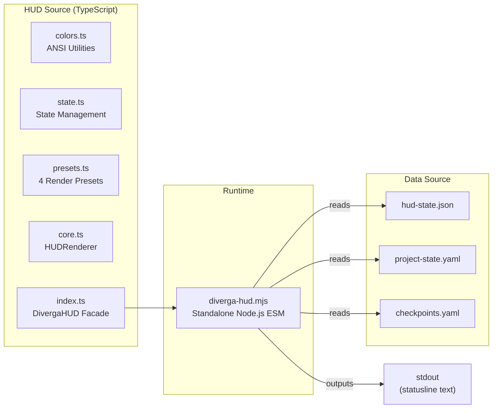

**Key design decisions**:
- Pure Node.js with no npm dependencies
- Runs as a standalone `.mjs` script via Claude Code's `statusLine` feature
- Completely independent of oh-my-claudecode or any other plugin
- State cached in `.research/hud-state.json` for fast reads

#### 3.4.2 Presets

| Preset | Content | Use Case |
|--------|---------|----------|
| `research` | Project name, stage, checkpoint progress bar, memory health % | Default for daily research |
| `checkpoint` | Detailed per-checkpoint status (passed/pending/upcoming) | Decision-making sessions |
| `memory` | Memory health details, storage metrics | Debugging and troubleshooting |
| `minimal` | Project name and current stage only | Clean terminal preference |

**Example output (research preset)**:
```
[microscope] AI-Ethics-HR | Stage: foundation | [filled][filled][empty]...(2/11) | [brain] 95%
```

#### 3.4.3 Auto-Setup on Install

The HUD installs by adding a `statusLine` entry to `~/.claude/settings.json`:

```json
{
  "statusLine": {
    "type": "command",
    "command": "node ~/.claude/hud/diverga-hud.mjs"
  }
}
```

This is handled automatically by `/diverga-hud setup` or during the 2-step setup wizard.

### 3.5 Setup System (v8.0+)

#### 3.5.1 Two-Step Wizard

The setup process was reduced from 9 steps (v7.0) to 2 steps (v8.0.1-patch4):

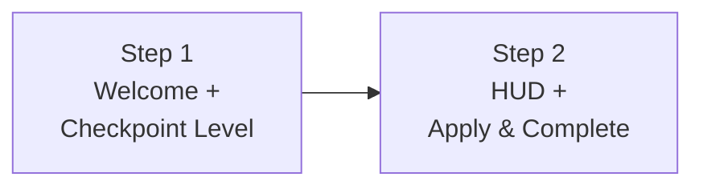

**Step 1 -- Welcome + Checkpoint Level**:
- Detects existing `.research/` directory
- Shows project status if project exists
- Displays version and changelog highlights
- Checkpoint Level: Full (all 17) / Minimal (REQUIRED only) / Off

**Step 2 -- HUD + Apply & Complete**:
- HUD Display: Enable / Disable
- Creates `diverga-config.json`
- Sets up HUD statusline in `~/.claude/settings.json`
- Creates initial `.research/` structure if new project
- Shows next steps and available commands

**Removed options** (vs v7.0): LLM Provider selection (Claude Code already authenticated), API Key configuration (not needed), Default Paradigm (auto-detected during research), Language selection (Claude Code naturally responds in user's input language).

#### 3.5.2 Auto-Project Detection

When a user enters a directory containing `.research/`, Diverga automatically loads the project context and displays a load banner with project name, current stage, checkpoint progress, and last session date.

#### 3.5.3 Natural Language Project Start

Users can initialize projects by describing their research intent:

```
"I want to conduct a systematic review on AI in education"
"meta-analysis on AI-assisted learning"
"[Korean] 체계적 문헌고찰을 시작하고 싶어"
```

The `intent_detector` module uses regex-based pattern matching to extract:
- Research type (systematic_review, meta_analysis, experimental, qualitative, mixed_methods, literature_review)
- Topic
- Confidence score (0.0-1.0; threshold 0.7 for auto-init)
- Detected language (EN/KR)
- Inferred paradigm (quantitative/qualitative/mixed)

After detection, the system presents a confirmation prompt before auto-initializing `.research/` and `docs/` directories.

### 3.9 Dashboard System (v8.0.1-patch4)

The `/diverga` command displays a live configuration dashboard showing:
- ASCII art logo with version
- System status (version, agent count, readiness)
- Configuration overview (checkpoint level, HUD preset, VS method status)
- Active project status (name, stage, memory health, decision count)
- API status for paper retrieval (Semantic Scholar, OpenAlex, Scopus, WoS)
- LLM provider status for batch screening (Groq, Anthropic, OpenAI, Ollama)
- MCP integration status (Zotero, Claude Code Browser, Gemini)
- Quick action shortcuts

The dashboard reads from `config/diverga-config.json`, `.research/project-state.yaml`, and environment variables to display live status.

### 3.6 VS Methodology Engine

#### 3.6.1 T-Score Calculation

The Typicality Score (T-Score) quantifies how conventional a given recommendation is:

| T-Score Range | Label | Meaning |
|---------------|-------|---------|
| >= 0.7 | Common | Highly typical, safe but limited novelty |
| 0.4 - 0.7 | Moderate | Balanced risk-novelty trade-off |
| 0.2 - 0.4 | Innovative | Novel approach, requires strong justification |
| < 0.2 | Experimental | Highly novel, high risk/high reward |

T-Scores are **dynamic** and **paradigm-contextualized**: the same methodology may have different T-Scores depending on the research paradigm (quantitative, qualitative, or mixed methods).

#### 3.6.2 Three-Stage VS Process

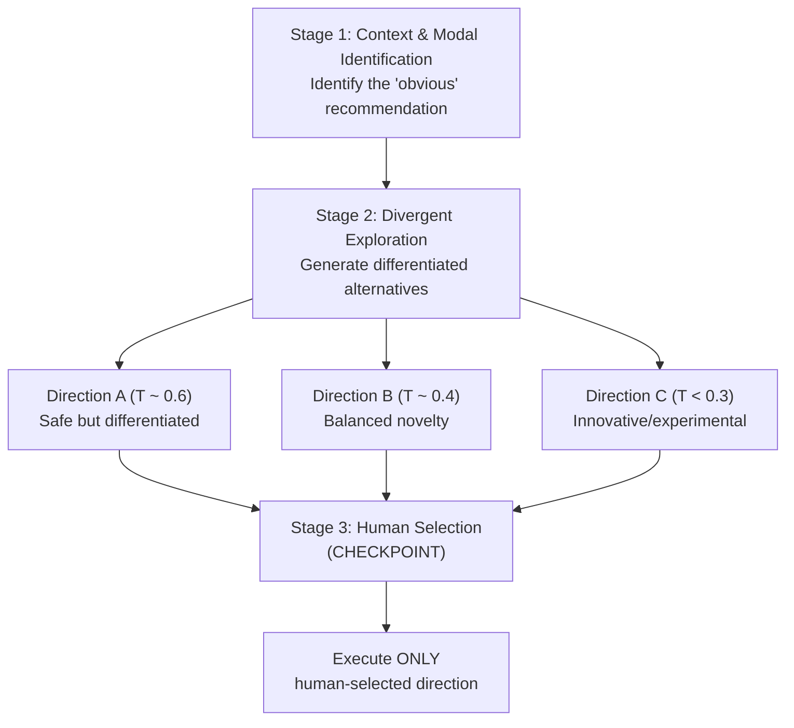

#### 3.6.3 Mode Collapse Prevention

The VS Engine employs 5 creativity mechanisms (available at FULL, ENHANCED, or LIGHT levels per agent):

| Mechanism | Description | Application |
|-----------|-------------|-------------|
| **Forced Analogy** | Borrow concepts from distant fields | Cross-domain framework selection |
| **Iterative Loop** | 3-5 divergent-convergent cycles | Methodology refinement |
| **Semantic Distance** | Explore conceptually distant ideas | Theory exploration |
| **Temporal Reframing** | Shift time perspectives | Research design evolution |
| **Community Simulation** | Simulate academic discussions | Peer review preparation |

### 3.7 Humanization Pipeline

#### 3.7.1 Pipeline Architecture

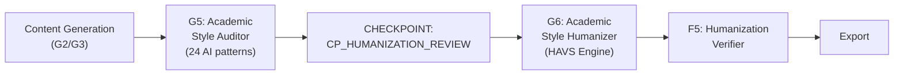

#### 3.7.2 HAVS Three-Phase Process

HAVS (Humanization-Adapted VS) adapts the core anti-modal principle for text transformation:

| Phase | Name | Description |
|-------|------|-------------|
| **Phase 0** | Transformation Context | Collect G5 analysis, target style, user mode |
| **Phase 1** | Modal Transformation Warning | Warn against easily-detectable transformations (T > 0.7) |
| **Phase 2** | Differentiated Directions | Present three transformation strategies for human selection |

Phase 2 directions:

| Direction | T-Score | Strategies | Best For |
|-----------|---------|------------|----------|
| A | ~0.6 | Vocabulary + phrase replacement | Conservative mode |
| B (recommended) | ~0.4 | + Sentence recombination, flow optimization | Balanced mode |
| C | ~0.2 | + Paragraph reorganization, style transfer | Aggressive mode |

#### 3.7.3 Transformation Modes

| Mode | Target Patterns | Best For |
|------|----------------|----------|
| **Conservative** | High-risk AI patterns only | Journal submissions |
| **Balanced** | High + medium-risk patterns | Most academic writing |
| **Aggressive** | All detectable patterns | Blog posts, informal writing |

#### 3.7.4 AI Pattern Detection (24 Categories)

G5-AcademicStyleAuditor identifies AI-generated text patterns across 24 categories derived from Wikipedia's AI Cleanup initiative, adapted for academic writing. Patterns are classified by risk level and each receives a transformation priority score.

#### 3.7.5 Verification Criteria

| Criterion | Target |
|-----------|--------|
| Meaning preservation | >= 95% semantic similarity |
| Citation accuracy | 100% preserved |
| Statistics accuracy | 100% preserved |
| Flow Naturalness Index | >= 0.7 (improved from AI-typical < 0.5) |

### 3.8 Systematic Review Pipeline (Category I)

#### 3.8.1 Pipeline Stages

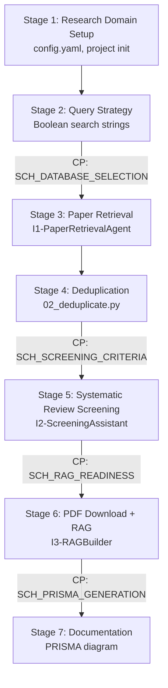

#### 3.8.2 PRISMA 2020 Compliance

The pipeline generates PRISMA 2020-compliant flow diagrams and documentation. I2-ScreeningAssistant performs 6-dimension screening using Groq (llama-3.3-70b) for cost-efficient processing.

#### 3.8.3 Project Types

| Type | Screening Threshold | Expected Output | Use Case |
|------|--------------------|-----------------|---------|
| `knowledge_repository` | 50% confidence (score >= 25) | 5,000 - 15,000 papers | Teaching, domain exploration |
| `systematic_review` | 90% confidence (score >= 40) | 50 - 300 papers | Meta-analysis, journal publication |

#### 3.8.4 Cost Optimization

| Stage | Provider | Cost per 100 papers |
|-------|----------|---------------------|
| Screening | Groq (llama-3.3-70b) | $0.01 |
| RAG Queries | Groq (llama-3.3-70b) | $0.02 |
| Embeddings | all-MiniLM-L6-v2 (local) | $0.00 |
| Fallback | Claude Haiku | $0.15 |

Total estimated cost for a 500-paper systematic review: ~$0.07.

#### 3.8.5 Human Checkpoints for Systematic Review

All four checkpoints ensure human oversight at database selection, screening criteria definition, RAG readiness confirmation, and PRISMA diagram generation. REQUIRED checkpoints (SCH_DATABASE_SELECTION, SCH_SCREENING_CRITERIA) halt the pipeline until explicit approval.

---

## 4. Data Design

### 4.1 Config Schema (diverga-config.json)

```yaml
# diverga-config.json
{
  "version": "8.1.0",
  "checkpoint_level": "full | minimal | off",
  "hud": {
    "enabled": true,
    "preset": "research | checkpoint | memory | minimal"
  },
  "language": "en",  // Language: defaults to "en"; Claude Code auto-detects from user input
  "paradigm": "auto | quantitative | qualitative | mixed",
  "integrations": {
    "semantic_scholar_api_key": "",
    "openalex_email": "",
    "zotero_mcp": false
  }
}
```

### 4.2 Project State Schema (.research/project-state.yaml)

```yaml
# .research/project-state.yaml
version: "8.1.0"
project:
  name: "AI-Ethics-HR"
  research_question: "How does AI affect ethical decision-making in HR?"
  paradigm: "quantitative"
  type: "meta_analysis"
  created_at: "2026-02-01T10:00:00Z"
  updated_at: "2026-02-07T14:30:00Z"

stage:
  current: "foundation"        # foundation|design|evidence|collection|analysis|synthesis|publication
  order: 1                     # 1-7
  started_at: "2026-02-01T10:00:00Z"

stages_completed:
  - name: "foundation"
    completed_at: "2026-02-03T16:00:00Z"
    archived_to: "changes/archive/2026-02-03-foundation/"

checkpoints:
  total: 17
  completed: 2
  pending: 15
  required_pending: 6

sessions:
  count: 5
  last_session_id: "session-def456"
  last_session_date: "2026-02-06T09:00:00Z"

memory:
  health_percent: 95
  decisions_count: 4
  baselines_count: 3
```

### 4.3 Decision Log Schema (.research/decision-log.yaml)

```yaml
# .research/decision-log.yaml
version: "7.0.0"
decisions:
  - id: "dec-001"
    timestamp: "2026-02-01T10:15:00Z"
    checkpoint: "CP_RESEARCH_DIRECTION"
    stage: "foundation"
    agent: "diverga:a1"
    decision:
      selected: "Meta-analysis"
      alternatives:
        - option: "Systematic Review"
          t_score: 0.75
          rationale: "Good for narrative synthesis"
        - option: "Scoping Review"
          t_score: 0.45
          rationale: "Better for mapping literature"
      vs_process:
        modal_avoided: "Narrative literature review"
        exploration_depth: 3
    rationale: "Need quantitative synthesis for effect size aggregation"
    context:
      research_question: "How does AI affect ethical decision-making in HR?"
      paradigm: "quantitative"
      prior_decisions: []
    metadata:
      session_id: "session-abc123"
      user_confirmed: true
      confirmation_timestamp: "2026-02-01T10:16:30Z"

  - id: "dec-002"
    timestamp: "2026-02-01T11:00:00Z"
    checkpoint: "CP_PARADIGM_SELECTION"
    # ... (same schema as above)
```

### 4.4 Checkpoint State Schema (.research/checkpoints.yaml)

```yaml
# .research/checkpoints.yaml
version: "7.0.0"
checkpoints:
  CP_RESEARCH_DIRECTION:
    level: "required"
    stage: "foundation"
    status: "completed"           # pending|completed|skipped
    completed_at: "2026-02-01T10:16:30Z"
    decision_id: "dec-001"

  CP_PARADIGM_SELECTION:
    level: "required"
    stage: "foundation"
    status: "completed"
    completed_at: "2026-02-01T11:05:00Z"
    decision_id: "dec-002"

  CP_THEORY_SELECTION:
    level: "recommended"
    stage: "foundation"
    status: "pending"
    completed_at: null
    decision_id: null

  # ... (remaining 14 checkpoints)

summary:
  total: 17
  completed: 2
  pending: 15
  required_completed: 2
  required_pending: 6
```

### 4.5 HUD State Schema (.research/hud-state.json)

```json
{
  "version": "8.1.0",
  "preset": "research",
  "project_name": "AI-Ethics-HR",
  "stage": "foundation",
  "stage_order": 1,
  "checkpoints_completed": 2,
  "checkpoints_total": 17,
  "memory_health": 95,
  "last_updated": "2026-02-07T14:30:00Z"
}
```

---

## 5. Interface Design

### 5.1 Skill Invocation Patterns

Diverga skills are invoked via Claude Code slash commands:

| Pattern | Example | Description |
|---------|---------|-------------|
| Hyphen prefix (recommended) | `/diverga-help` | Always works, most reliable |
| Colon prefix | `/diverga:help` | Requires plugin load |
| Agent direct | `/diverga:a1` | Invoke specific agent |
| Memory commands | `/diverga:memory status` | Memory system operations |
| HUD commands | `/diverga-hud setup` | HUD configuration |
| Setup | `/diverga:setup` or `/diverga-setup` | Run setup wizard |

### 5.2 Agent Dispatch API (Task Tool)

Agents are invoked programmatically via the Claude Code Task tool:

```python
Task(
    subagent_type="diverga:<agent_id>",   # e.g., "diverga:a1"
    model="<opus|sonnet|haiku>",          # Model tier
    prompt="<research context + task>"     # Task description
)
```

The Task Interceptor (Layer 2) automatically enriches the prompt with project context before the agent receives it.

### 5.3 Memory CLI Commands

| Command | Description |
|---------|-------------|
| `/diverga:memory status` | Show project status overview |
| `/diverga:memory context [--verbose]` | Display full research context |
| `/diverga:memory init --name N --question Q --paradigm P` | Initialize new project |
| `/diverga:memory decision list [--stage S]` | List decisions, optionally filtered by stage |
| `/diverga:memory decision add --checkpoint C --selected S --rationale R` | Record new decision |
| `/diverga:memory decision amend --id ID --selected S --rationale R` | Create amendment to existing decision |
| `/diverga:memory archive [STAGE] [--summary S]` | Archive completed stage |
| `/diverga:memory generate ARTIFACT_ID` | Generate research artifact |
| `/diverga:memory migrate [--dry-run]` | Run v6.8 to v7.0 migration |
| `/diverga:memory search "query"` | Semantic memory search |
| `/diverga:memory export --format md|json` | Export project data |

### 5.4 Auto-Trigger Keyword Mapping (EN + KR)

Complete mapping of 44 agents to their trigger keywords:

**Category A: Foundation**

| Agent | EN Triggers | KR Triggers |
|-------|-------------|-------------|
| A1 | "research question", "RQ", "refine question" | "연구 질문", "연구문제" |
| A2 | "theoretical framework", "theory", "conceptual model" | "이론적 프레임워크", "이론적 틀" |
| A3 | "devil's advocate", "critique", "counterargument" | "반론", "비판적 검토" |
| A4 | "IRB", "ethics", "informed consent" | "연구 윤리", "IRB", "동의서" |
| A5 | "paradigm", "ontology", "epistemology" | "패러다임", "존재론", "인식론" |
| A6 | "conceptual framework", "visualize framework" | "개념적 프레임워크", "프레임워크 시각화" |

**Category B: Evidence**

| Agent | EN Triggers | KR Triggers |
|-------|-------------|-------------|
| B1 | "systematic review", "literature search", "PRISMA" | "체계적 문헌고찰", "문헌 검색" |
| B2 | "quality appraisal", "RoB", "GRADE" | "품질 평가", "비뚤림 평가" |
| B3 | "effect size", "Cohen's d", "Hedges' g" | "효과크기", "효과 크기 추출" |
| B4 | "research trends", "emerging topics" | "연구 동향", "트렌드" |
| B5 | "batch PDF", "parallel processing", "multiple PDFs" | "PDF 일괄 처리", "병렬 처리" |

**Category C: Design & Meta-Analysis**

| Agent | EN Triggers | KR Triggers |
|-------|-------------|-------------|
| C1 | "quantitative design", "experimental design", "RCT" | "양적 연구 설계", "실험 설계" |
| C2 | "qualitative design", "phenomenology", "grounded theory" | "질적 연구 설계", "현상학" |
| C3 | "mixed methods", "sequential design", "convergent" | "혼합방법", "혼합 연구" |
| C4 | "intervention materials", "experimental materials" | "중재 자료", "실험 자료 개발" |
| C5 | "meta-analysis", "pooled effect", "heterogeneity" | "메타분석", "통합 효과" |
| C6 | "data extraction", "PDF extract" | "데이터 추출", "PDF 추출" |
| C7 | "error prevention", "validation", "data check" | "오류 방지", "검증" |

**Category D: Data Collection**

| Agent | EN Triggers | KR Triggers |
|-------|-------------|-------------|
| D1 | "sampling", "sample size", "G*Power" | "표집", "표본 크기", "샘플링" |
| D2 | "interview", "focus group" | "인터뷰", "면담", "포커스 그룹" |
| D3 | "observation", "observation protocol" | "관찰", "관찰 프로토콜" |
| D4 | "instrument", "measurement", "scale development" | "측정 도구", "척도 개발" |

**Category E: Analysis**

| Agent | EN Triggers | KR Triggers |
|-------|-------------|-------------|
| E1 | "statistical analysis", "ANOVA", "regression", "SEM" | "통계 분석", "회귀", "분산분석" |
| E2 | "qualitative coding", "thematic analysis" | "질적 코딩", "주제 분석" |
| E3 | "mixed methods integration", "joint display" | "혼합방법 통합", "통합 분석" |
| E4 | "R code", "Python code", "analysis code" | "R 코드", "Python 코드" |
| E5 | "sensitivity analysis", "robustness check" | "민감도 분석", "강건성 검증" |

**Category F: Quality**

| Agent | EN Triggers | KR Triggers |
|-------|-------------|-------------|
| F1 | "consistency check", "internal consistency" | "일관성 검토", "내적 일관성" |
| F2 | "checklist", "CONSORT", "STROBE", "COREQ" | "체크리스트", "보고 지침" |
| F3 | "reproducibility", "replication", "OSF" | "재현성", "반복가능성" |
| F4 | "bias detection", "trustworthiness" | "편향 탐지", "신뢰성" |
| F5 | "humanization verify", "AI text check" | "휴먼화 검증", "AI 텍스트 확인" |

**Category G: Communication**

| Agent | EN Triggers | KR Triggers |
|-------|-------------|-------------|
| G1 | "journal match", "where to publish" | "저널 매칭", "투고처" |
| G2 | "academic writing", "manuscript" | "학술 글쓰기", "논문 작성" |
| G3 | "peer review", "reviewer response" | "동료 심사", "리뷰어 응답" |
| G4 | "preregistration", "OSF", "pre-register" | "사전등록", "OSF" |
| G5 | "AI pattern", "check AI writing", "style audit" | "AI 패턴", "AI 글쓰기 검토" |
| G6 | "humanize", "humanization", "natural writing" | "휴먼화", "자연스러운 글쓰기" |

**Category H: Specialized**

| Agent | EN Triggers | KR Triggers |
|-------|-------------|-------------|
| H1 | "ethnography", "fieldwork", "participant observation" | "민족지학", "현장연구" |
| H2 | "action research", "participatory", "practitioner" | "실행연구", "참여적 연구" |

**Category I: Systematic Review Automation**

| Agent | EN Triggers | KR Triggers |
|-------|-------------|-------------|
| I0 | "systematic review", "PRISMA", "literature review automation" | "체계적 문헌고찰", "프리즈마" |
| I1 | "fetch papers", "retrieve papers", "database search" | "논문 수집", "논문 검색" |
| I2 | "screen papers", "PRISMA screening", "inclusion criteria" | "논문 스크리닝", "선별" |
| I3 | "build RAG", "vector database", "embed documents" | "RAG 구축", "벡터 DB" |

---

## 6. File Structure

### 6.1 Repository Layout

```
~/.claude/plugins/diverga/
│
├── CLAUDE.md                          # Primary architecture reference
├── README.md                          # User-facing documentation
├── LICENSE                            # MIT License
│
├── .claude/
│   └── skills/                        # Claude Code skill definitions (legacy path)
│
├── .claude-plugin/
│   └── marketplace.json               # Plugin marketplace metadata
│
├── skills/                            # 51+ SKILL.md files
│   ├── a1/SKILL.md                    # A1-ResearchQuestionRefiner
│   ├── a2/SKILL.md                    # A2-TheoreticalFrameworkArchitect
│   ├── a3/SKILL.md                    # A3-DevilsAdvocate
│   ├── a4/SKILL.md                    # A4-ResearchEthicsAdvisor
│   ├── a5/SKILL.md                    # A5-ParadigmWorldviewAdvisor
│   ├── a6/SKILL.md                    # A6-ConceptualFrameworkVisualizer
│   ├── b1/SKILL.md                    # B1-SystematicLiteratureScout
│   ├── b2/SKILL.md                    # B2-EvidenceQualityAppraiser
│   ├── b3/SKILL.md                    # B3-EffectSizeExtractor
│   ├── b4/SKILL.md                    # B4-ResearchRadar
│   ├── b5/SKILL.md                    # B5-ParallelDocumentProcessor
│   ├── c1/SKILL.md                    # C1-QuantitativeDesignConsultant
│   ├── c2/SKILL.md                    # C2-QualitativeDesignConsultant
│   ├── c3/SKILL.md                    # C3-MixedMethodsDesignConsultant
│   ├── c4/SKILL.md                    # C4-ExperimentalMaterialsDeveloper
│   ├── c5/SKILL.md                    # C5-MetaAnalysisMaster
│   ├── c6/SKILL.md                    # C6-DataIntegrityGuard
│   ├── c7/SKILL.md                    # C7-ErrorPreventionEngine
│   ├── d1/SKILL.md                    # D1-SamplingStrategyAdvisor
│   ├── d2/SKILL.md                    # D2-InterviewFocusGroupSpecialist
│   ├── d3/SKILL.md                    # D3-ObservationProtocolDesigner
│   ├── d4/SKILL.md                    # D4-MeasurementInstrumentDeveloper
│   ├── e1/SKILL.md                    # E1-QuantitativeAnalysisGuide
│   ├── e2/SKILL.md                    # E2-QualitativeCodingSpecialist
│   ├── e3/SKILL.md                    # E3-MixedMethodsIntegration
│   ├── e4/SKILL.md                    # E4-AnalysisCodeGenerator
│   ├── e5/SKILL.md                    # E5-SensitivityAnalysisDesigner
│   ├── f1/SKILL.md                    # F1-InternalConsistencyChecker
│   ├── f2/SKILL.md                    # F2-ChecklistManager
│   ├── f3/SKILL.md                    # F3-ReproducibilityAuditor
│   ├── f4/SKILL.md                    # F4-BiasTrustworthinessDetector
│   ├── f5/SKILL.md                    # F5-HumanizationVerifier
│   ├── g1/SKILL.md                    # G1-JournalMatcher
│   ├── g2/SKILL.md                    # G2-AcademicCommunicator
│   ├── g3/SKILL.md                    # G3-PeerReviewStrategist
│   ├── g4/SKILL.md                    # G4-PreregistrationComposer
│   ├── g5/SKILL.md                    # G5-AcademicStyleAuditor
│   ├── g6/SKILL.md                    # G6-AcademicStyleHumanizer
│   ├── h1/SKILL.md                    # H1-EthnographicResearchAdvisor
│   ├── h2/SKILL.md                    # H2-ActionResearchFacilitator
│   ├── i0/SKILL.md                    # I0-ReviewPipelineOrchestrator
│   ├── i1/SKILL.md                    # I1-PaperRetrievalAgent
│   ├── i2/SKILL.md                    # I2-ScreeningAssistant
│   ├── i3/SKILL.md                    # I3-RAGBuilder
│   ├── diverga/SKILL.md              # Master coordinator
│   ├── research-coordinator/SKILL.md  # Research coordinator
│   ├── research-orchestrator/SKILL.md # Agent orchestrator
│   ├── memory/SKILL.md               # Memory system
│   ├── setup/SKILL.md                # Setup wizard
│   ├── help/SKILL.md                 # Help system
│   ├── hud/SKILL.md                  # HUD configuration
│   └── universal-ma-codebook/SKILL.md # Universal meta-analysis codebook
│
├── lib/
│   ├── memory/
│   │   └── src/                       # Python memory library (~4,870 LOC)
│   │       ├── __init__.py
│   │       ├── models.py              # Data models
│   │       ├── context_trigger.py     # Layer 1: Keyword detection
│   │       ├── task_interceptor.py    # Layer 2: Agent context injection
│   │       ├── checkpoint_trigger.py  # Checkpoint auto-trigger
│   │       ├── fs_state.py            # Filesystem state management
│   │       ├── dual_tree.py           # Dual-tree structure
│   │       ├── archive.py             # Stage archiving
│   │       ├── decision_log.py        # Decision audit trail
│   │       ├── session_hooks.py       # Session lifecycle
│   │       ├── schema.py              # Research schema definitions
│   │       ├── templates.py           # Template engine
│   │       ├── artifact_generator.py  # Artifact generation
│   │       ├── cli.py                 # CLI commands
│   │       ├── migration.py           # v6.8 -> v7.0 migration
│   │       ├── memory_api.py          # Unified facade API
│   │       ├── intent_detector.py     # Natural language intent detection
│   │       ├── project_initializer.py # Auto-project initialization
│   │       └── doc_generator.py       # Auto-doc synchronization
│   │
│   └── hud/                           # TypeScript HUD system
│       ├── colors.ts                  # ANSI color utilities
│       ├── state.ts                   # State management
│       ├── presets.ts                 # 4 render presets
│       ├── core.ts                    # HUDRenderer class
│       └── index.ts                   # DivergaHUD facade
│
├── templates/
│   ├── systematic-review/             # 8 template files
│   ├── meta-analysis/                 # 4 template files
│   └── checkpoints/                   # 17 checkpoint definitions
│
├── docs/                              # Documentation
│   ├── AGENT-ORCHESTRATION-GUIDE.md
│   ├── AGENT-REFERENCE.md
│   ├── CHANGELOG.md
│   ├── CHECKPOINT_TIMELINE_GUIDE.md
│   ├── DESIGN_SYSTEM.md
│   ├── QUICKSTART.md
│   ├── ROADMAP.md
│   ├── SETUP.md
│   ├── SDD.md                        # This document
│   ├── USAGE-EXAMPLES.md
│   ├── USAGE-GUIDELINES.md
│   ├── havs-integration.md
│   ├── i18n/                          # Korean translations
│   ├── images/                        # Visual assets
│   ├── internal/                      # Development docs
│   ├── plans/                         # Planning documents
│   └── releases/                      # Version-specific notes
│       ├── v7.0-RELEASE-NOTES.md
│       ├── v8.0-RELEASE-NOTES.md
│       └── ...
│
└── scripts/                           # Installation and utility scripts
```

### 6.2 Per-Project .research/ (Hidden System Files)

```
<project_root>/.research/
├── baselines/                 # Stable research foundations
│   ├── literature/
│   ├── methodology/
│   └── framework/
├── changes/
│   ├── current/               # Active work artifacts
│   └── archive/               # Timestamped completed stages
├── sessions/                  # Per-session YAML records
├── project-state.yaml         # Project metadata and stage
├── decision-log.yaml          # Immutable decision audit trail
├── checkpoints.yaml           # Checkpoint completion states
└── hud-state.json             # HUD display cache
```

### 6.3 Per-Project docs/ (Auto-Generated Visible Documentation)

```
<project_root>/docs/
├── PROJECT_STATUS.md          # Progress overview
├── DECISION_LOG.md            # Human-readable decision history
├── RESEARCH_AUDIT.md          # IRB and reproducibility audit
├── METHODOLOGY.md             # Research design documentation
├── TIMELINE.md                # Milestones and deadlines
├── REFERENCES.md              # Key papers and citations
└── README.md                  # Project overview
```

These files are auto-synchronized from `.research/` state whenever decisions are added, checkpoints are completed, or methodology changes occur.

---

## 7. Model Routing Matrix

### 7.1 Complete Agent-to-Model Mapping (44 Agents)

#### HIGH Tier -- Opus (17 agents)

| Agent ID | Name | Category |
|----------|------|----------|
| A1 | ResearchQuestionRefiner | Foundation |
| A2 | TheoreticalFrameworkArchitect | Foundation |
| A3 | DevilsAdvocate | Foundation |
| A5 | ParadigmWorldviewAdvisor | Foundation |
| B5 | ParallelDocumentProcessor | Evidence |
| C1 | QuantitativeDesignConsultant | Design |
| C2 | QualitativeDesignConsultant | Design |
| C3 | MixedMethodsDesignConsultant | Design |
| C5 | MetaAnalysisMaster | Meta-Analysis |
| D4 | MeasurementInstrumentDeveloper | Data Collection |
| E1 | QuantitativeAnalysisGuide | Analysis |
| E2 | QualitativeCodingSpecialist | Analysis |
| E3 | MixedMethodsIntegration | Analysis |
| G3 | PeerReviewStrategist | Communication |
| G6 | AcademicStyleHumanizer | Communication |
| H1 | EthnographicResearchAdvisor | Specialized |
| H2 | ActionResearchFacilitator | Specialized |
| I0 | ReviewPipelineOrchestrator | Systematic Review |

#### MEDIUM Tier -- Sonnet (16 agents)

| Agent ID | Name | Category |
|----------|------|----------|
| A4 | ResearchEthicsAdvisor | Foundation |
| A6 | ConceptualFrameworkVisualizer | Foundation |
| B1 | SystematicLiteratureScout | Evidence |
| B2 | EvidenceQualityAppraiser | Evidence |
| C4 | ExperimentalMaterialsDeveloper | Design |
| C6 | DataIntegrityGuard | Meta-Analysis |
| C7 | ErrorPreventionEngine | Meta-Analysis |
| D1 | SamplingStrategyAdvisor | Data Collection |
| D2 | InterviewFocusGroupSpecialist | Data Collection |
| E5 | SensitivityAnalysisDesigner | Analysis |
| F3 | ReproducibilityAuditor | Quality |
| F4 | BiasTrustworthinessDetector | Quality |
| G1 | JournalMatcher | Communication |
| G2 | AcademicCommunicator | Communication |
| G4 | PreregistrationComposer | Communication |
| G5 | AcademicStyleAuditor | Communication |
| I1 | PaperRetrievalAgent | Systematic Review |
| I2 | ScreeningAssistant | Systematic Review |

#### LOW Tier -- Haiku (8 agents)

| Agent ID | Name | Category |
|----------|------|----------|
| B3 | EffectSizeExtractor | Evidence |
| B4 | ResearchRadar | Evidence |
| D3 | ObservationProtocolDesigner | Data Collection |
| E4 | AnalysisCodeGenerator | Analysis |
| F1 | InternalConsistencyChecker | Quality |
| F2 | ChecklistManager | Quality |
| F5 | HumanizationVerifier | Quality |
| I3 | RAGBuilder | Systematic Review |

#### System Skills (7)

| Skill | Type | Description |
|-------|------|-------------|
| research-coordinator | Master | Main orchestration and dispatch |
| research-orchestrator | System | Agent management and routing |
| memory | System | Memory system CLI |
| setup | System | 2-step setup wizard |
| help | System | Help and documentation |
| hud | System | HUD configuration |
| universal-ma-codebook | Template | Meta-analysis codebook |

### 7.2 Distribution Summary

| Tier | Count | Percentage |
|------|-------|------------|
| Opus (HIGH) | 17 | 38.6% |
| Sonnet (MEDIUM) | 16 | 36.4% |
| Haiku (LOW) | 8 | 18.2% |
| System Skills | 7 | -- |
| **Total** | **44 agents + 7 skills** | **51 SKILL.md files** |

---

## 8. Version History

### 8.1 Evolution Summary

| Version | Date | Codename | Key Changes |
|---------|------|----------|-------------|
| **v8.1.0** | 2026-02-09 | "Checkpoint Enforcement" | Mandatory AskUserQuestion at all checkpoints, Agent Prerequisite Map, multi-agent coordination, 120 tests |
| **v8.0.1-patch4** | 2026-02-07 | "English-First" | English-first UI, 2-step setup, dashboard, box-drawing fixes, branding cleanup |
| **v8.0.1** | 2026-02-07 | -- | Plugin discovery fixes, troubleshooting guide |
| **v8.0.0** | 2026-02-04 | "Visible Research" | Independent HUD, 2-step setup, natural language project start, docs/ auto-generation |
| **v7.0.0** | 2026-02-04 | "Persistent Intelligence" | Memory System, 3-layer context, 17 checkpoints, decision audit trail, dual-tree filesystem |
| v6.9.2 | 2026-02-02 | -- | Marketplace cache synchronization fix |
| v6.9.1 | 2026-02-01 | -- | Version field in SKILL.md, plugin discovery fix, local symlinks |
| **v6.8.0** | 2026-01-28 | -- | Memory System foundation, semantic search, lifecycle hooks |
| **v6.7.0** | 2026-01-30 | "Systematic Review Automation" | Category I agents (I0-I3), PRISMA 2020 pipeline, 44 agents, 9 categories |
| v6.6.3 | -- | -- | Codex CLI SKILL.md implementation |
| v6.6.2 | -- | -- | Multi-CLI compatibility, NPM package (@diverga/codex-setup) |
| **v6.5.0** | -- | -- | Parallel execution via Task tool |
| **v6.4.0** | -- | -- | Plugin Marketplace registration, auto-trigger dispatch |
| **v6.3.0** | -- | -- | Meta-Analysis Agent System (C5/C6/C7), 40 agents |
| **v6.2.0** | -- | -- | Parallel Document Processing (B5), 37 agents |
| **v6.1.0** | -- | -- | Humanization Pipeline (G5/G6/F5), HAVS integration, 36 agents |
| v6.0.1 | 2026-01-25 | -- | Agent restructuring to category-based naming (A1-H2), 33 agents |
| **v6.0.0** | 2026-01-25 | "Human-Centered" | Removed Sisyphus/OMC modes, mandatory checkpoints, renamed to Diverga |
| v5.0.0 | 2025-01-25 | "Sisyphus" | Sisyphus protocol, paradigm detection, 27 agents |
| v4.0.0 | 2025-01-25 | -- | Context persistence, pipeline templates, integration hub, 21 agents |
| v3.2.0 | -- | -- | OMC integration, model routing |
| v3.0.0 | 2025-01-24 | "VS-Research v3.0" | Dynamic T-Score, 5 creativity mechanisms, 14 user checkpoints, 20 agents |
| v2.0.0 | 2025-01-22 | -- | VS methodology integration (arXiv:2510.01171) |
| v1.0.0 | 2025-01-22 | -- | Initial release, 20 agents, bilingual support |

### 8.2 Major Architectural Transitions

**v1-v3 (Foundation Era)**: Established the core agent architecture, VS methodology integration, and T-Score system. Started with 20 agents and built up to comprehensive creativity mechanisms.

**v4-v5 (Automation Era)**: Added context persistence, pipeline templates, and the Sisyphus autonomous protocol. Grew to 27 agents with full qualitative and mixed-methods support.

**v6.0 (Human-Centered Revolution)**: Removed all autonomous operation modes (Sisyphus, ralph, ultrawork). Established mandatory human checkpoints as the core design principle. Renamed from "Research Coordinator" to "Diverga."

**v6.1-v6.7 (Agent Expansion)**: Rapid growth from 33 to 44 agents through Humanization Pipeline (G5/G6/F5), Parallel Document Processing (B5), Meta-Analysis System (C5/C6/C7), and Systematic Review Automation (I0-I3).

**v7.0 (Memory System)**: Introduced cross-session persistence with 3-layer context loading, immutable decision audit trails, and dual-tree filesystem architecture.

**v8.0 (Project Visibility)**: Added independent HUD statusline, simplified 2-step setup, natural language project initialization, and auto-generated researcher-facing documentation.

---

*Document generated: 2026-02-07*
*Diverga Version: 8.1.0*
*Total Agents: 44 | Total Skills: 51 | Total Categories: 9*
