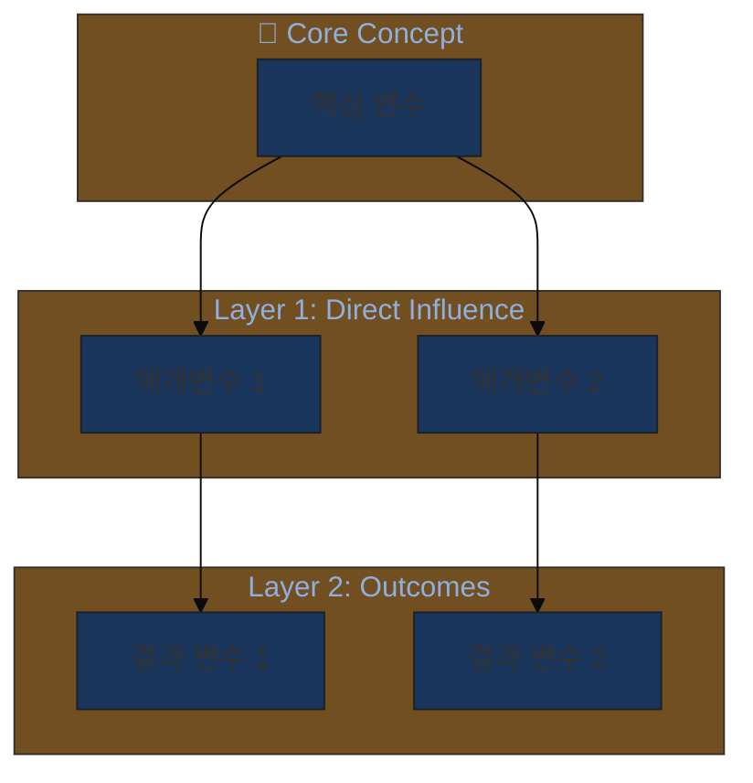
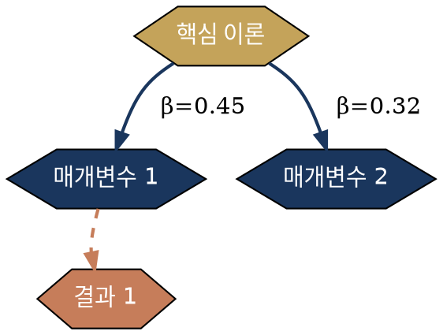

# 21-Conceptual-Framework-Visualizer 설계 문서

**버전**: 3.1.0
**작성일**: 2025-01-24
**상태**: 승인됨 - 구현 준비 완료

---

## 1. 개요

### 1.1 목적
연구 Discussion 섹션에 필요한 Conceptual Framework 시각화를 **Code-First, Image-Second** 접근 방식으로 생성하는 전문 에이전트.

### 1.2 핵심 특징
- **Full VS (5단계)**: 최대 창의성, 모달 시각화 회피
- **멀티 모달리티**: Mermaid / Graphviz / Python / D3.js 자동 선택
- **학술적 품질**: 저널 출판 수준의 Figure 생성
- **T-Score 기반**: 시각화 유형별 전형성 점수로 차별화 보장

### 1.3 에이전트 정보
| 항목 | 값 |
|------|-----|
| ID | 21 |
| 이름 | conceptual-framework-visualizer |
| 카테고리 | E - Publication & Communication |
| VS 수준 | Full (5단계) |
| 아이콘 | 🎨 |

---

## 2. VS 5단계 아키텍처

```
┌─────────────────────────────────────────────────────────────────┐
│            21-Conceptual-Framework-Visualizer                   │
│                    Full VS 5단계 프로세스                        │
├─────────────────────────────────────────────────────────────────┤
│                                                                 │
│  Phase 0: 맥락 수집 (Context Gathering)                         │
│  ┌────────────────────────────────────────────────────────────┐│
│  │  입력: 연구 질문, 이론적 배경, 주요 변수, 가설             ││
│  │  추출: 노드(개념) + 엣지(관계) + 메타데이터(강도/방향)     ││
│  │  출력: JSON 형태의 논리 구조                               ││
│  └────────────────────────────────────────────────────────────┘│
│         ↓                                                       │
│  Phase 1: 모달 시각화 식별 (Modal Detection)                    │
│  ┌────────────────────────────────────────────────────────────┐│
│  │  ⚠️ "가장 뻔한 시각화는 X" → 명시적 금지                   ││
│  │  예: 단순 박스-화살표, TAM 스타일 3단계 모델              ││
│  │  T-Score > 0.8 시각화 유형 목록화 → 회피 대상              ││
│  └────────────────────────────────────────────────────────────┘│
│         ↓                                                       │
│  Phase 2: Long-Tail 시각화 탐색 (Creative Sampling)             │
│  ┌────────────────────────────────────────────────────────────┐│
│  │  방향 A (T≈0.6): 안전하지만 차별화                        ││
│  │    - 동심원 구조, 계층적 레이어                           ││
│  │  방향 B (T≈0.4): 독특하고 정당화 가능                     ││
│  │    - 네트워크 그래프, 동적 흐름도                         ││
│  │  방향 C (T<0.25): 혁신적/실험적                           ││
│  │    - 3D 투시도, 유기적 형태, 메타포 기반                  ││
│  └────────────────────────────────────────────────────────────┘│
│         ↓                                                       │
│  Phase 3: 기술 스택 선택 (Technology Selection)                 │
│  ┌────────────────────────────────────────────────────────────┐│
│  │  복잡도/스타일에 따라 자동 선택:                          ││
│  │  - Mermaid: 빠른 프로토타입, 간단한 흐름도               ││
│  │  - Graphviz: 계층/네트워크 구조, 자동 레이아웃            ││
│  │  - Python: 데이터 기반 시각화, 통계적 관계               ││
│  │  - D3.js/SVG: 고급 스타일링, 인터랙티브 요소             ││
│  └────────────────────────────────────────────────────────────┘│
│         ↓                                                       │
│  Phase 4: 코드 생성 및 실행 (Code Generation)                   │
│  ┌────────────────────────────────────────────────────────────┐│
│  │  1. 논리 구조 → 선택된 기술의 코드 생성                   ││
│  │  2. 학술적 스타일 가이드 적용 (색상, 폰트, 레이아웃)      ││
│  │  3. 코드 실행/렌더링 지침 제공                            ││
│  │  4. SVG/PNG 출력 형식 권장                                ││
│  └────────────────────────────────────────────────────────────┘│
│         ↓                                                       │
│  Phase 5: 독창성 검증 (Originality Check)                       │
│  ┌────────────────────────────────────────────────────────────┐│
│  │  자가 질문: "80%의 AI가 이 시각화를 생성할까?"            ││
│  │  - YES → Phase 2로 돌아가 더 낮은 T-Score 시도            ││
│  │  - NO → 최종 출력 및 스타일 미세조정                      ││
│  │  학술적 정당성 검증: 이 시각화가 이론을 정확히 반영하는가?││
│  └────────────────────────────────────────────────────────────┘│
│                                                                 │
└─────────────────────────────────────────────────────────────────┘
```

---

## 3. T-Score 테이블 (시각화 전형성 점수)

### 3.1 🔴 T > 0.8 (회피 대상 - 모달 시각화)

| T-Score | 시각화 유형 | 설명 | 회피 이유 |
|---------|------------|------|----------|
| 0.95 | 단순 박스-화살표 흐름도 | X → M → Y 형태의 직선 배치 | 모든 AI가 기본 생성, 차별화 불가 |
| 0.90 | TAM/UTAUT 스타일 3단계 | 좌→우 3열 구조 | 수천 편의 논문에서 동일 형태 사용 |
| 0.85 | 단순 원형 순환 다이어그램 | A→B→C→A 형태의 사이클 | 지나치게 일반적 |
| 0.82 | 2×2 매트릭스 | 4분면 분류 체계 | BCG 매트릭스 클리셰 |

### 3.2 🟡 T = 0.5-0.8 (조건부 사용 - 맥락 필요)

| T-Score | 시각화 유형 | 적합 상황 | 차별화 전략 |
|---------|------------|----------|------------|
| 0.75 | 계층적 트리 구조 | 분류 체계, 상위-하위 관계 | 색상 그라데이션, 노드 크기 변화 |
| 0.65 | 동심원 구조 | 중심 개념에서 확산되는 관계 | 레이어별 테마 색상, 3D 깊이감 |
| 0.55 | 샌키 다이어그램 | 흐름량/비중 표현 필요 시 | 곡선 처리, 색상 인코딩 |

### 3.3 🟢 T = 0.3-0.5 (권장 - 차별화된 시각화)

| T-Score | 시각화 유형 | 강점 | 적합 연구 유형 |
|---------|------------|------|---------------|
| 0.45 | 네트워크 그래프 (Force-directed) | 복잡한 상호관계 표현 | 변수 간 다중 경로 모델 |
| 0.40 | 레이어드 아키텍처 다이어그램 | 수준별 구조 명확화 | 이론적 계층 구조 |
| 0.35 | 시간축 통합 흐름도 | 종단 연구, 과정 모델 | 인과적 메커니즘 연구 |

### 3.4 🔵 T < 0.3 (혁신적 - 정당화 필요)

| T-Score | 시각화 유형 | 효과 | 주의사항 |
|---------|------------|------|---------|
| 0.25 | 유기적 형태 (생물학적 메타포) | 시스템의 적응성/성장 표현 | 이론적 근거 명시 필요 |
| 0.20 | 지형도 스타일 (등고선) | 영향력의 강도/범위 표현 | 해석 가이드 제공 필요 |
| 0.15 | 3D 투시/등각투영도 | 다차원 관계의 입체적 표현 | 인쇄 품질 고려 |
| 0.10 | 추상 기하학적 구성 | 이론의 핵심 구조 강조 | 학술적 정당성 필수 |

### 3.5 색상 팔레트 T-Score

| T-Score | 색상 스타일 | 예시 |
|---------|------------|------|
| 0.90 | 기본 Office 파랑/빨강 | 회피 |
| 0.70 | 단색 그라데이션 | 조건부 |
| 0.45 | Academic Modern (네이비, 골드, 테라코타) | **권장** |
| 0.30 | 자연 팔레트 (숲/바다 톤) | 적합 시 |
| 0.15 | 모노크롬 + 강조색 1개 | 혁신적 |

---

## 4. 기술 스택 선택 매트릭스

| 시각화 유형 | 복잡도 | 권장 기술 | 장점 |
|------------|--------|----------|------|
| 단순 흐름도 | 낮음 | Mermaid | 빠른 생성, 마크다운 호환 |
| 계층 구조 | 중간 | Graphviz | 자동 레이아웃, 깔끔한 배치 |
| 변수 관계 네트워크 | 높음 | Python NetworkX | 데이터 기반, 커스터마이징 |
| 출판용 Figure | 최고 | D3.js + SVG | 벡터 품질, 완전 제어 |

---

## 5. 코드 템플릿

### 5.1 Mermaid 템플릿 (T≈0.65, 동심원 구조)



### 5.2 Graphviz DOT 템플릿 (T≈0.40, 네트워크 구조)



### 5.3 Python NetworkX 템플릿 (T≈0.45, Force-directed)

```python
import networkx as nx
import matplotlib.pyplot as plt
from matplotlib.patches import FancyBboxPatch

# Academic Modern 팔레트
COLORS = {
    'navy': '#1a365d',
    'gold': '#c4a35a',
    'terracotta': '#c67d5a',
    'sage': '#87a878'
}

# 그래프 구성
G = nx.DiGraph()
G.add_edges_from([
    ('독립변수', '매개변수1', {'weight': 0.45}),
    ('독립변수', '매개변수2', {'weight': 0.32}),
    ('매개변수1', '종속변수', {'weight': 0.58}),
    ('매개변수2', '종속변수', {'weight': 0.41}),
])

# 시각화
pos = nx.spring_layout(G, k=2, iterations=50)
plt.figure(figsize=(12, 8), facecolor='white')

nx.draw_networkx_nodes(G, pos, node_size=3000,
                       node_color=[COLORS['navy'], COLORS['gold'],
                                   COLORS['gold'], COLORS['terracotta']])
nx.draw_networkx_edges(G, pos, edge_color=COLORS['navy'],
                       connectionstyle="arc3,rad=0.1", arrows=True)
nx.draw_networkx_labels(G, pos, font_size=10, font_family='sans-serif')

plt.axis('off')
plt.tight_layout()
plt.savefig('conceptual_framework.svg', format='svg', transparent=True)
```

---

## 6. 에이전트 연동 설계

### 6.1 의존성 맵

```
┌─────────────────────────────────────────────────────────────────┐
│                    에이전트 연동 아키텍처                        │
├─────────────────────────────────────────────────────────────────┤
│                                                                 │
│  ┌──────────────────┐                                          │
│  │ 02-Theoretical   │ ─────────────────┐                       │
│  │ Framework        │  이론 구조 JSON   │                       │
│  │ Architect        │                   ▼                       │
│  └──────────────────┘    ┌──────────────────────────┐          │
│                          │  21-Conceptual-Framework │          │
│  ┌──────────────────┐    │  Visualizer              │          │
│  │ 03-Devils        │ ──▶│  (Full VS)               │          │
│  │ Advocate         │    │                          │          │
│  │                  │    │  입력:                   │          │
│  └──────────────────┘    │  - 변수 관계 JSON        │          │
│    비판적 피드백          │  - 이론적 배경           │          │
│                          │  - 타겟 저널 스타일      │          │
│  ┌──────────────────┐    │                          │          │
│  │ 10-Statistical   │ ──▶│  출력:                   │          │
│  │ Analysis Guide   │    │  - 렌더링 코드           │          │
│  │                  │    │  - SVG/PNG 지침          │          │
│  └──────────────────┘    │  - 스타일 가이드         │          │
│    분석 결과 통계         └───────────┬──────────────┘          │
│                                       │                        │
│                                       ▼                        │
│                          ┌──────────────────────────┐          │
│                          │ 18-Academic              │          │
│                          │ Communicator             │          │
│                          │                          │          │
│                          │ Figure 캡션 생성         │          │
│                          │저널 형식 조정           │          │
│                          └──────────────────────────┘          │
│                                                                 │
│  병렬 실행 그룹: [02 + 10] → [21] → [18]                       │
│  순차 파이프라인: 02 → 21 → 03 (검토) → 21 (수정)              │
│                                                                 │
└─────────────────────────────────────────────────────────────────┘
```

### 6.2 입력/출력 스키마

```yaml
# 입력 스키마
input_schema:
  required:
    - research_context:
        research_question: string
        theoretical_background: string
        key_variables:
          - name: string
            type: "independent|mediator|moderator|dependent"
            description: string
        hypotheses:
          - id: string
            statement: string
            variables: [string]
  optional:
    - target_journal_style: string  # APA, Nature, etc.
    - preferred_visualization_type: string
    - t_score_preference: "conservative|balanced|innovative"
    - color_palette: string

# 출력 스키마
output_schema:
  main_output:
    - logical_structure: JSON  # 노드/엣지 구조
    - modal_visualizations: [string]  # 회피 대상 목록
    - recommended_visualization:
        type: string
        t_score: float
        justification: string
    - rendering_code:
        technology: "mermaid|graphviz|python|d3js"
        code: string
        execution_instructions: string
    - style_guide:
        colors: object
        fonts: object
        layout_notes: string
  checkpoints:
    - CP_VISUALIZATION_PREFERENCE (🔵 PREFERENCE)
    - CP_T_SCORE_APPROVAL (🟡 APPROVAL)
    - CP_CODE_EXECUTION (🟢 ITERATION)
```

---

## 7. 구현 체크리스트

- [x] 에이전트 기본 정의 완료
- [x] VS 5단계 아키텍처 설계
- [x] T-Score 테이블 정의
- [x] 기술 스택 선택 매트릭스
- [x] 코드 템플릿 작성
- [x] 에이전트 연동 설계
- [ ] SKILL.md 파일 작성
- [ ] agent-registry.yaml 업데이트
- [ ] 테스트 시나리오 작성

---

## 8. 다음 단계

1. **SKILL.md 파일 생성**: `/research-coordinator/.claude/skills/research-agents/21-conceptual-framework-visualizer/SKILL.md`
2. **agent-registry.yaml 업데이트**: 21번 에이전트 메타데이터 추가
3. **테스트**: 실제 연구 맥락에서 시각화 생성 테스트
4. **반복 개선**: 피드백 기반 T-Score 조정 및 템플릿 확장

---

**작성자**: Claude Code + Research Coordinator
**승인**: 사용자 확인 완료
**버전 이력**: v1.0.0 (2025-01-24) - 초기 설계
